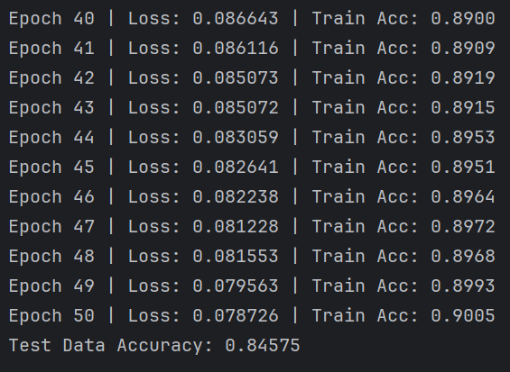

# Object Classification Using Feed-Forward Neural Networks

## 1. Problem Description and Rationale

The goal of this project is to design and implement a feed-forward artificial neural network (ANN) capable of classifying grayscale images of simple doodle objects. Each image contains a single object represented by a white foreground on a black background. The classification task is based purely on the shape of the object, without relying on color information.

This project serves as a case study in applying fully connected neural networks to image-based classification problems and demonstrates how a custom neural network library can be used for training, evaluation, and inference.

### Dataset Link
https://quickdraw.withgoogle.com/data

---

## 2. Dataset Description and Preprocessing

### Dataset Description
- Image format: Grayscale PNG images
- Image resolution: 28 × 28 pixels
- Number of classes: 10 (hand, bicycle, butterfly, computer, eye, eyeglasses, spider, face, key, T-shirt)
- Each image contains a single object
- Foreground pixels are white, background pixels are black

### Preprocessing Steps
1. Each 28 × 28 image is flattened into a 784-dimensional vector.
2. Pixel values are normalized to the range [0, 1] by dividing by 255.
3. Class labels are encoded into integer values using a label encoder.
4. The dataset is split into training (80%) and testing (20%) subsets.

All preprocessing steps are performed automatically during dataset loading.

---

## 3. Neural Network Architecture and Justification

The feed-forward neural network uses the following architecture:

| Layer          | Number of Neurons |
|----------------|-------------------|
| Input          | 784 (28 × 28)     |
| Hidden Layer 1 | 50                |
| Hidden Layer 2 | 25                |
| Output         | 10                |

### Architecture Justification
- The input layer size matches the flattened image dimensionality.
- Two hidden layers allow the network to learn hierarchical shape features.
- The gradual reduction in neuron count helps prevent overfitting.
- The output layer contains one neuron per object class.

---

## 4. Training Configuration and Evaluation Results

### Training Parameters
- Batch size: 50
- Number of epochs: 50
- Learning rate: 0.5
- Weight initialization: Random uniform distribution
- Loss Function: MSE
- Activation Function: Sigmoid

## 5. Accuracy

